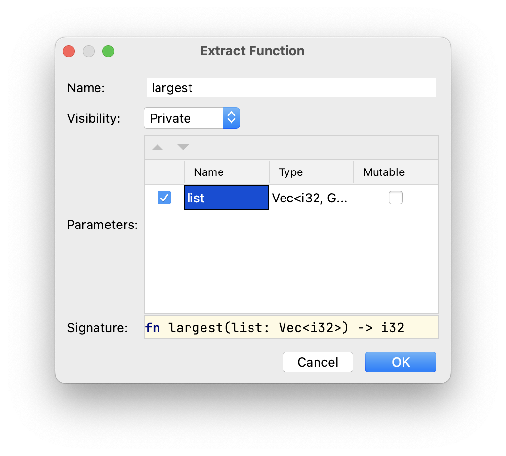

## Removing Duplication by Refactorings

To eliminate this duplication, we can create an abstraction by defining a
function that operates on any list of integers given to it in a parameter. This
solution makes our code clearer and lets us express the concept of finding the
largest number in a list abstractly.

We can achieve that in several steps using various refactorings available in %IDE_NAME%.

### Step 1: Extracting a Function

Note the first frame in the editor starting at line 4. Select the whole frame and then either press &shortcut:ExtractMethod;
or choose *Refactor -> Extract Method...* from the right-click menu.

Enter `largest` as the name of the function, and change the name 
of the parameter to `list` as follows:



After running this command the whole fragment will be replaced by the following one-liner:

```rust
let largest = largest(number_list);
```

You will also see the extracted function:

```rust
fn largest(list: Vec<i32>) -> i32 {
    let mut largest = list[0];

    for number in list {
        if number > largest {
            largest = number;
        }
    }
    largest
}
```

Note that code is still complied and runs as before with the same results.

### Step 2: Renaming a Variable

To avoid name clashes let's rename a couple of variables:

- the first binding of the `largest` variable (line 4) should be renamed to `result`;
- the second binding of the `largest` variable (second frame in the editor) should 
be also renamed to `result`.

To do that, you can 
either press &shortcut:RenameElement; or choose *Refactor -> Rename...* after 
pointing at the corresponding variable. See also the [task introducing this refactoring](course://Common Programming Concepts/Variables/Introduce Variable Refactoring) if you are in trouble.

### Step 3: Replacing Duplicated Code Fragment

You can now select the whole third frame in the editor and replace it with yet another call
to the `largest` function, namely `largest(number_list);`.

At this time, you may also want to remove the `mut` modifier for the second `result` binding. 
We don't need it anymore.

### Step 4: Adjusting Types

We may also want to make our parameter a little more general. For that, 
let's replace `Vec<i32>` in the function definition with a reference 
to a slice `&[i32]`. This change introduces several compilation errors that 
can be fixed by adding `&` to the `number_list` variables at the `fn largest` call sites
and to the `number` variable in the head of the `for` loop inside the function
definition.

This change would allow us to use the same function for vectors, arrays, and any `i32` slices.